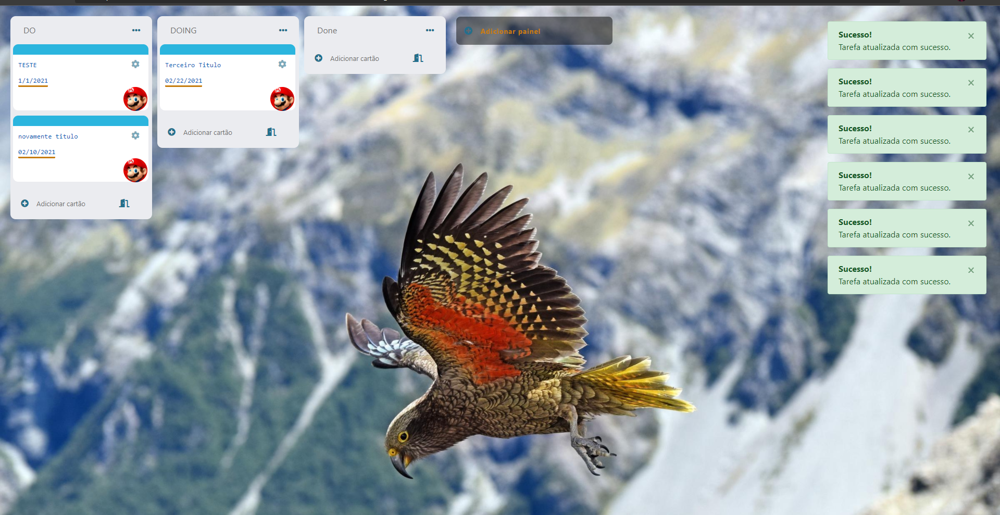

  <h1 align="center" >Mini Trello <a target="_blank" rel="noopener noreferrer"</h1>

  

<h1>Objetivo puramente didático aperfeiçoamento em JavaScript!</h1>
<strong>Não finalizado</strong>
<h3>Tecnologias utilizadas neste projeto:</h3>
<ul>
<li>JavaScript</li>
<li>JSRender</li>
<li>Dotnet Core 5</li>
<li>C#</li>
<li>Postman</li>
<li>Bootstrap (para os modais e notificações)</li>
<li>Promises</li>
<li>Injeção de dependência</li>
</ul>

<h2>A idéia do projeto</h2>

O <strong>Mini trello</strong> é uma aplicação web que foi desenvolvida com objetivo de aprender um pouco mais sobre javascript, se desafiando clonando partes de um projeto grande. O objetivo não é tornar o código um modelo (ainda) vou melhorando com o tempo conforme vou estudando mais a linguagem.

<h3>Scripts úteis</h3>

Para iniciar o servidor: <code>dotnet run</code>

Criar as migrations: <code>dotnet ef migrations "Nome do banco"  / dotnet ef update database</code>

<h1>Segue abaixo algumas imagens do projeto web:</h1>

| |
|:-------------------------:|
| |
| | 
